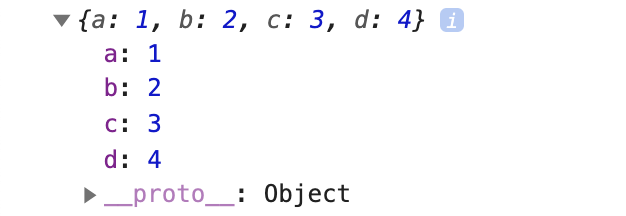
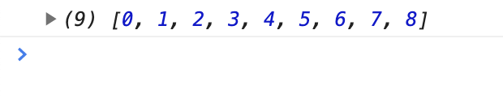

En este artículo, mostraré algunos trucos simples y sorprendentes de JavaScript que puedes usar para mejorar tu código.

## Truco 1: Combinar múltiples objetos

Considere que tiene tres objetos diferentes:

```js
const obj1 = { a: 1, b: 2 };
const obj2 = { c: 3 };
const obj3 = { d: 4 };
```

Si queremos que un objeto contenga las propiedades combinadas de todos estos objetos, podemos hacerlo con el simple código de abajo:

```js
const objCombined = { ...obj1, ...obj2, ...obj3 };
```

El registro `objCombined` imprimirá el siguiente valor en la consola:



El objeto `objCombined` es un objeto recién creado. La actualización de cualquier valor de `obj1`, `obj2` u `obj3` no afectará a los valores de `objCombined`.

Para los objetos anidados, las referencias de los objetos internos serán copiadas y no crearán nuevos. La sintaxis de propagación copiará todas las propiedades del objeto, pero sólo creará un nuevo objeto en el nivel superior.

También puede combinar objetos usando el método `Object.assign()`.

## Truco 2: Insertar valores entre una matriz

Considere que tiene el siguiente conjunto de números enteros:

```js
const arr = [0, 1, 2, 3, 5, 6, 7, 8];
```

¿Y si queremos insertar el entero 4 en el índice 4 de la matriz?

Podemos hacerlo simplemente usando la función de empalme en el prototipo de `Array`. La sintaxis de la función de empalme es:

```js
arr.splice(index, itemsToDelete, item1ToAdd, item2ToAdd, ...)
```

Para insertar el entero 4 en el índice 4, escribimos el código:

```js
arr.splice(4, 0, 4);
```

This will update the array to:



Para insertar múltiples números enteros en un índice, también podemos escribir:

```js
arr.splice(4, 0, 100, 101, 102);
```

Esto actualizará la matriz original a:

```js
```

<!-- https://medium.com/developers-arena/some-simple-and-amazing-javascript-tricks-292e1962b1f6 -->
